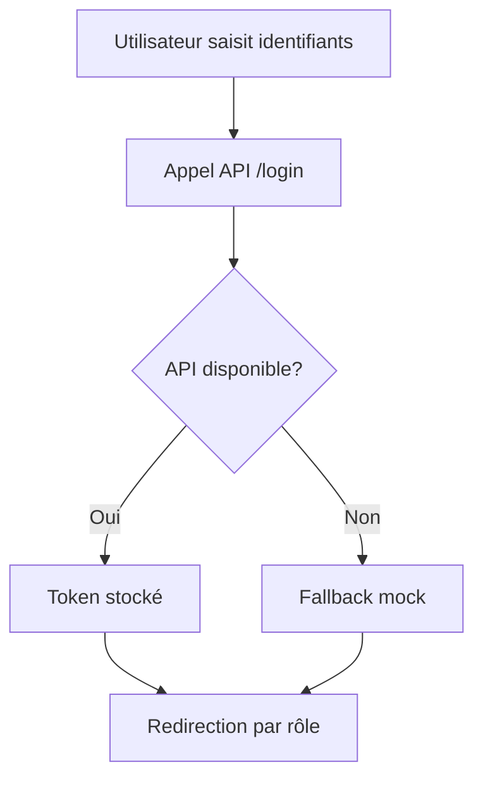
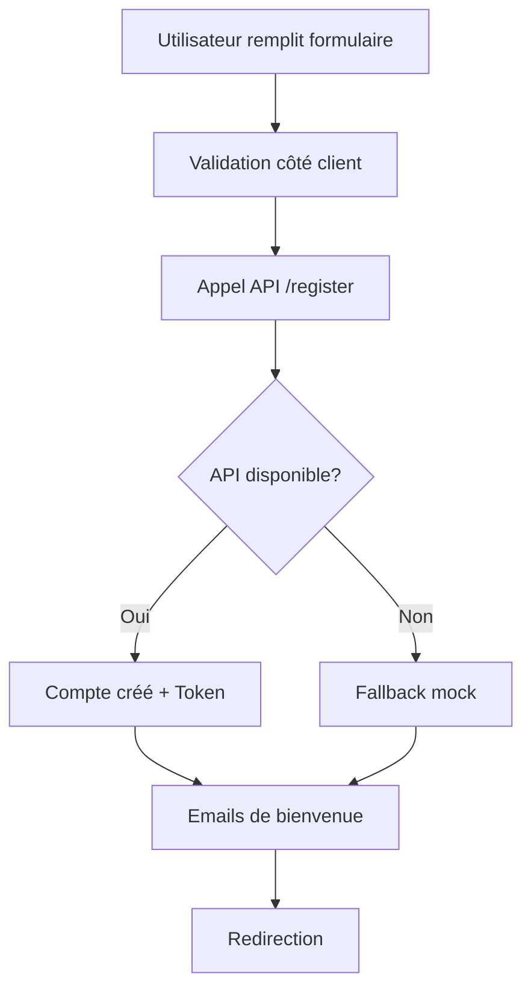
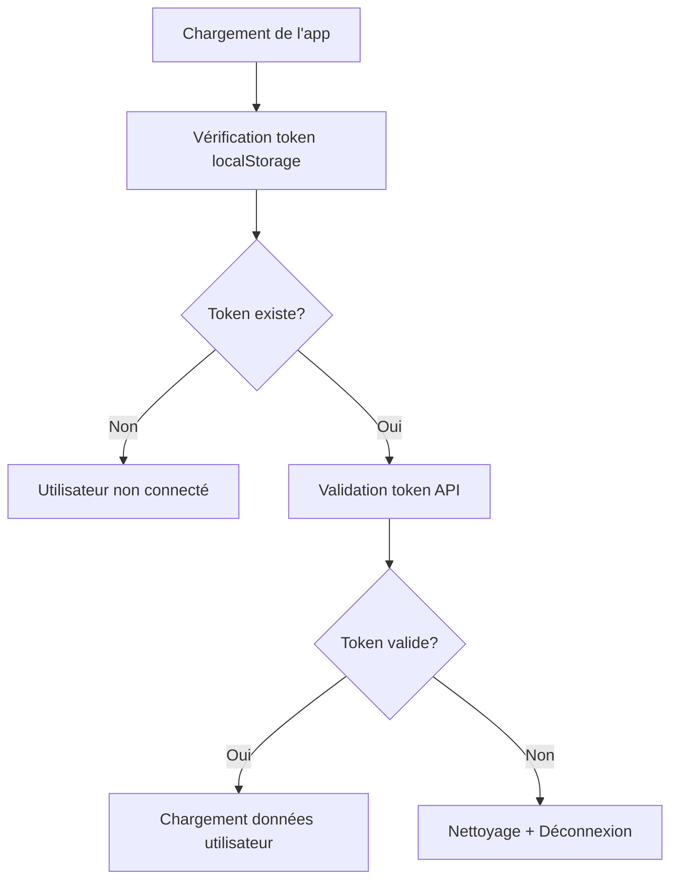

# Intégration API d'Authentification - DOREMI

## Vue d'ensemble

Cette intégration permet de consommer l'API d'authentification du backend Laravel dans le frontend React. Le système de connexion et d'inscription utilise maintenant des données réelles provenant de l'API au lieu de données mockées.

## Fichiers modifiés/créés

### 1. Service d'Authentification (`src/lib/authService.ts`)
- Service complet pour interagir avec l'API d'authentification Laravel
- Gestion des tokens JWT et de la persistance
- Méthodes pour login, register, logout, validation de token
- Support de l'upload de fichiers (CV pour les formateurs)
- Gestion des erreurs et types TypeScript

### 2. Contexte d'Authentification (`src/context/AuthContext.tsx`)
- Intégration avec l'API Laravel
- Fallback vers le système mock en cas d'erreur API
- Validation automatique des tokens au démarrage
- Conversion des données API vers le format local
- Gestion de la persistance des sessions

### 3. Formulaire de Connexion (`src/components/auth/LoginForm.tsx`)
- Gestion améliorée des erreurs API
- Messages d'erreur dynamiques
- Support des comptes de test avec fallback

## Configuration requise

### Variables d'environnement
Assurez-vous que votre fichier `.env` contient :

```env
# URL de l'API Laravel
VITE_API_URL=http://localhost:8000/api

# URL des images (optionnel)
VITE_IMAGE_URL=http://localhost:8000/storage
```

### Backend Laravel
Assurez-vous que votre backend Laravel est configuré avec :
- CORS activé pour le frontend
- Routes API d'authentification disponibles
- Laravel Passport ou Sanctum configuré
- Base de données avec des utilisateurs de test

## Fonctionnalités implémentées

### ✅ Connexion
- Authentification via email/mot de passe
- Validation des tokens JWT
- Gestion des sessions persistantes
- Redirection automatique par rôle

### ✅ Inscription
- Création de compte avec validation
- Support des rôles (étudiant, formateur, recruteur)
- Upload de CV pour les formateurs
- Sélection du cycle d'étude pour les étudiants

### ✅ Gestion des tokens
- Stockage sécurisé des tokens
- Validation automatique des tokens
- Rafraîchissement des tokens (si supporté)
- Nettoyage automatique des sessions expirées

### ✅ Gestion d'erreurs
- Messages d'erreur dynamiques
- Fallback vers le système mock
- Gestion des erreurs réseau
- Validation côté client et serveur

## Endpoints API utilisés

| Méthode | Endpoint | Description |
|---------|----------|-------------|
| POST | `/api/login` | Connexion utilisateur |
| POST | `/api/register` | Inscription utilisateur |
| GET | `/api/user` | Informations utilisateur connecté |
| POST | `/api/logout` | Déconnexion utilisateur |
| POST | `/api/refresh` | Rafraîchissement du token (optionnel) |

## Structure des données

### LoginRequest
```typescript
interface LoginRequest {
  email: string;
  password: string;
}
```

### RegisterRequest
```typescript
interface RegisterRequest {
  name: string;
  surname: string;
  email: string;
  password: string;
  role: 'admin' | 'teacher' | 'student' | 'recruiter';
  student_cycle?: 'lyceen' | 'licence' | 'master' | 'doctorat';
  cv?: File;
}
```

### AuthResponse
```typescript
interface AuthResponse {
  user: User;
  token: string;
}
```

### User (API)
```typescript
interface User {
  id: number;
  name: string;
  surname: string;
  email: string;
  role: 'admin' | 'teacher' | 'student' | 'recruiter';
  email_verified_at?: string;
  created_at: string;
  updated_at: string;
}
```

## Utilisation

### 1. Démarrer le backend Laravel
```bash
cd back
php artisan serve
```

### 2. Démarrer le frontend React
```bash
cd doremi-edu-hub-main
npm start
```

### 3. Tester l'authentification
- Naviguez vers la page de connexion
- Utilisez les comptes de test ou créez un nouveau compte
- Vérifiez la redirection automatique selon le rôle

## Comptes de test

Le système inclut un fallback vers des comptes de test si l'API n'est pas disponible :

- **Étudiant** : `etudiant@doremi.fr`
- **Formateur** : `formateur@doremi.fr`
- **Admin** : `admin@doremi.fr`
- **Recruteur** : `recruteur@doremi.fr`

## Flux d'authentification

### 1. Connexion


### 2. Inscription


### 3. Validation de session


## Sécurité

### ✅ Mesures implémentées
- Tokens JWT sécurisés
- Validation côté serveur
- Nettoyage automatique des sessions expirées
- Headers d'authentification automatiques
- Gestion des erreurs sans exposition de données sensibles

### 🔒 Recommandations
- Utilisez HTTPS en production
- Configurez CORS correctement
- Implémentez la rotation des tokens
- Ajoutez la validation 2FA si nécessaire

## Dépannage

### Erreur "Personal access client not found"
Cette erreur indique que Laravel Passport n'est pas configuré. Pour la résoudre :

```bash
cd back
php artisan passport:install
```

Ou créez manuellement les clients :
```php
use Laravel\Passport\ClientRepository;
$clientRepo = new ClientRepository();
$clientRepo->createPersonalAccessClient(null, 'Personal Access Client', 'http://localhost');
$clientRepo->createPasswordGrantClient(null, 'Password Grant Client', 'http://localhost');
```

### Erreur CORS
Vérifiez que le backend Laravel a CORS configuré pour accepter les requêtes du frontend.

### Token invalide
Le système nettoie automatiquement les tokens expirés et redirige vers la connexion.

### Erreur d'inscription
Vérifiez que tous les champs requis sont remplis et que l'email n'existe pas déjà.

### Fallback activé
Si vous voyez des messages "Erreur API, utilisation du système mock", vérifiez :
- Que le backend Laravel est démarré
- Que l'URL de l'API est correcte
- Que les routes d'authentification sont disponibles
- Que Laravel Passport est configuré

## Prochaines étapes

1. **Validation email** : Implémenter la vérification d'email
2. **Mot de passe oublié** : Ajouter la réinitialisation de mot de passe
3. **Profil utilisateur** : Synchroniser les données de profil avec l'API
4. **2FA** : Ajouter l'authentification à deux facteurs
5. **Sessions multiples** : Gérer les sessions sur plusieurs appareils

## Support

Pour toute question ou problème, consultez :
- La documentation de l'API Laravel
- Les logs du navigateur (F12)
- Les logs du serveur Laravel
- Le fichier de configuration API (`src/config/api.ts`)
